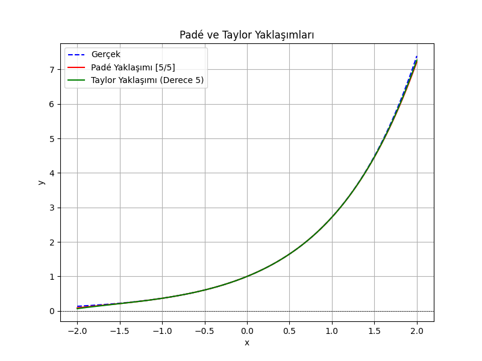
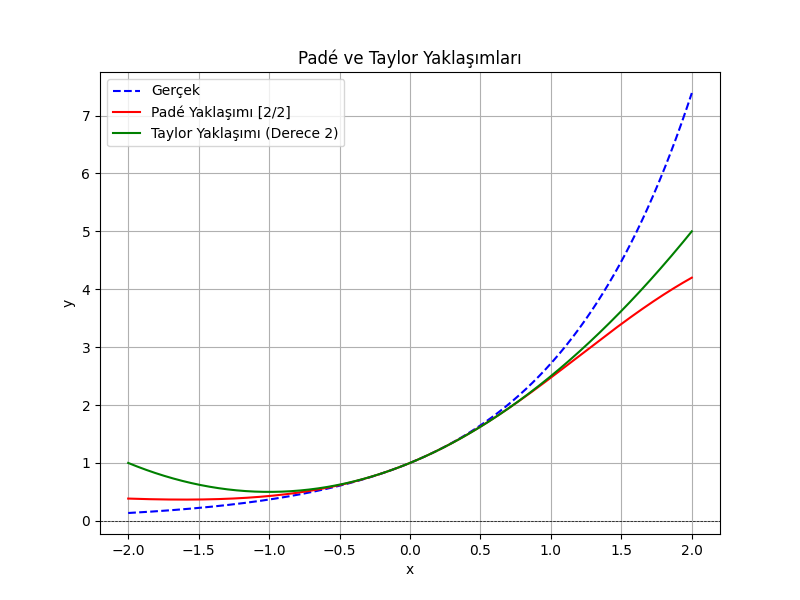

# Pade Yaklaşımı

Padé yaklaşımı, bir fonksiyonu rasyonel bir kesirle (polinomların oranı) yaklaşık olarak temsil eden bir yöntemdir. Bu yöntem genellikle Taylor serilerinin yakınsama sorunlarını çözmek için kullanılır.

## Padé Yaklaşımı Algoritması

1. Yaklaşılacak fonksiyonun Taylor serisini elde et.
2. Belirli bir derecede (örneğin [m/n]) Padé kesirini oluştur:
    - m: paydaki polinomun derecesi
    - n: paydaydaki polinomun derecesi
3. Polinom katsayılarını çözmek için lineer bir denklem sistemi oluştur ve çöz.
4. Yaklaşımı plot ederek görselleştir.

## Örnek

Bu örnekte e^x fonksiyonu için bir [2/2] Padé yaklaşımı yapılacaktır.

## Hangi Durumda Hangisi Daha İyi?

| Durum                              | Taylor                | Padé                  |
|------------------------------------|-----------------------|-----------------------|
| Yakın noktalar için doğruluk       | ✅                    | ✅                    |
| Geniş bir aralıkta yakınsama       | ❌                    | ✅                    |
| Kutupları olan fonksiyonlar        | ❌                    | ✅                    |
| Hızlı hesaplama gereken durumlar   | ✅                    | ❌                    |
| Osilasyonlu fonksiyonlar (sin, cos)| ✅ (Yakın noktada)    | ✅ (Geniş aralıkta)   |

## Kullanım

```bash
python3 -m venv venv
source venv/bin/activate
pip3 install -r requirements.txt
python __main__.py
```

## Sonuç




## Yazar

- [Muhtalip Dede](mailto:muhtalipdede@gmail.com)
